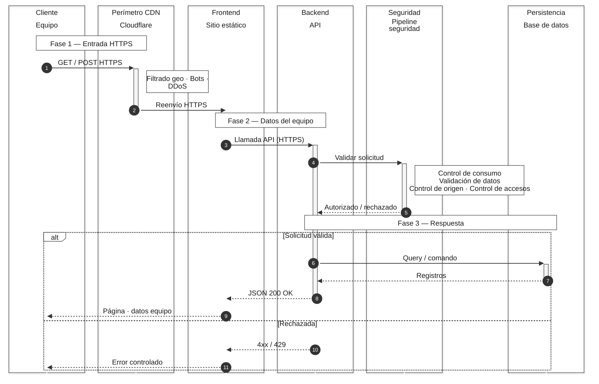
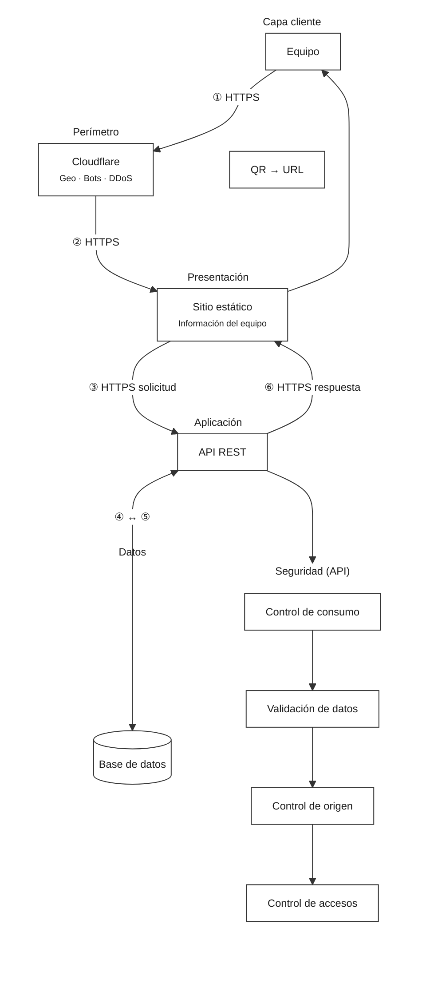

# Arquitectura de solicitudes — UML

Abre este archivo en [Mermaid Live Editor](https://mermaid.live) y pega el bloque del diagrama. Estilo corporativo: monocromático, compacto, sin fondos en columnas; bordes solo en mensajes, notas y bloques `alt`/`opt`.

---

## Diagrama de secuencia (corporativo)

---

## Diagrama de componentes (corporativo)

